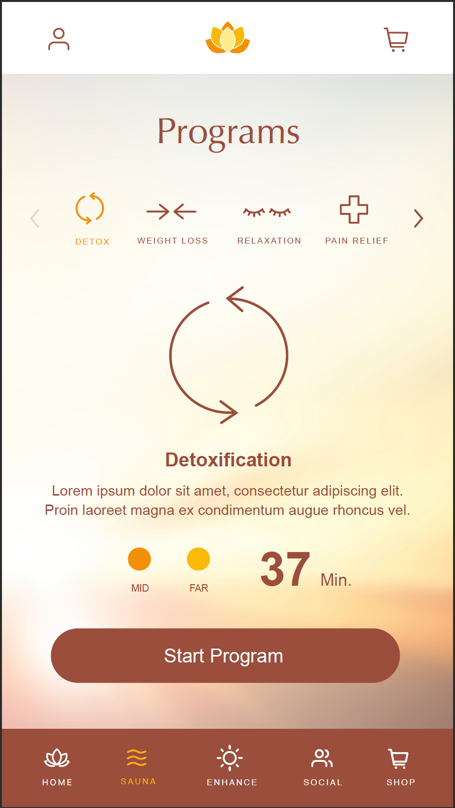
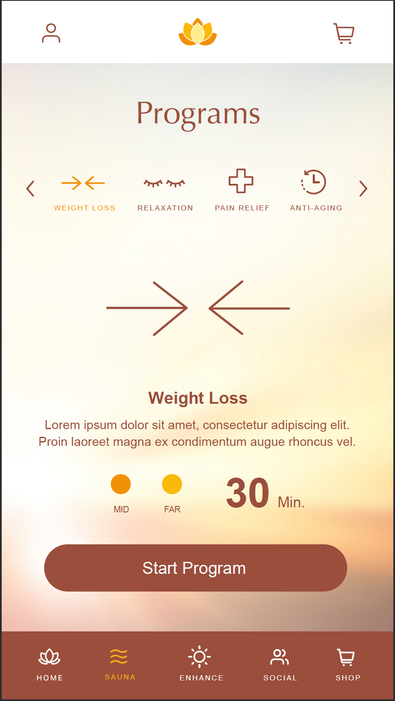
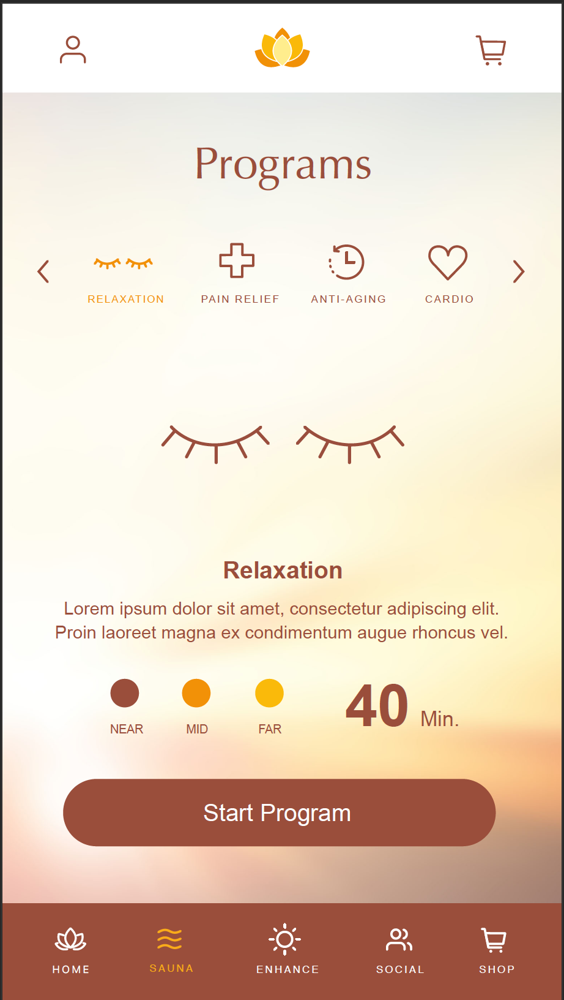
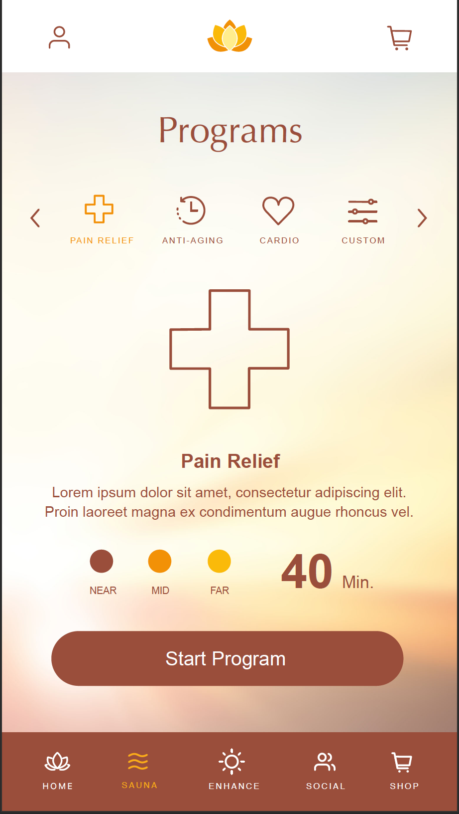
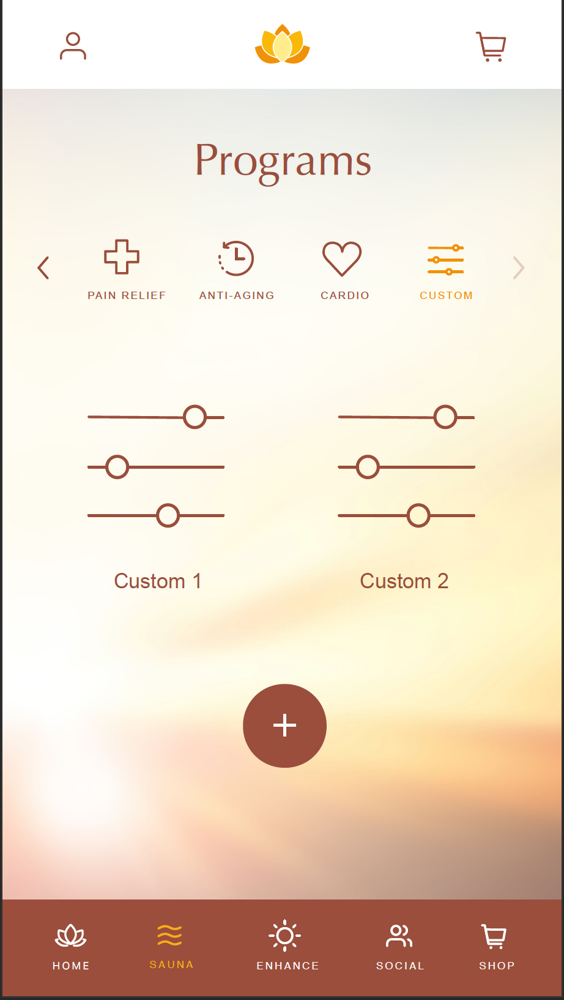
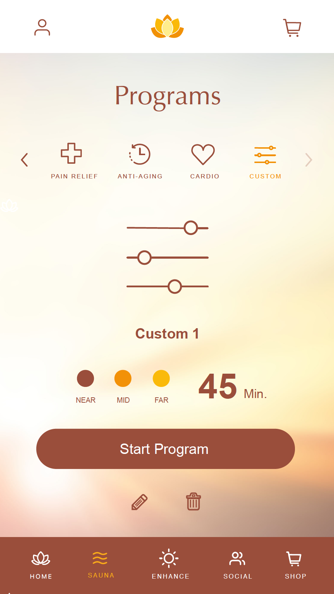
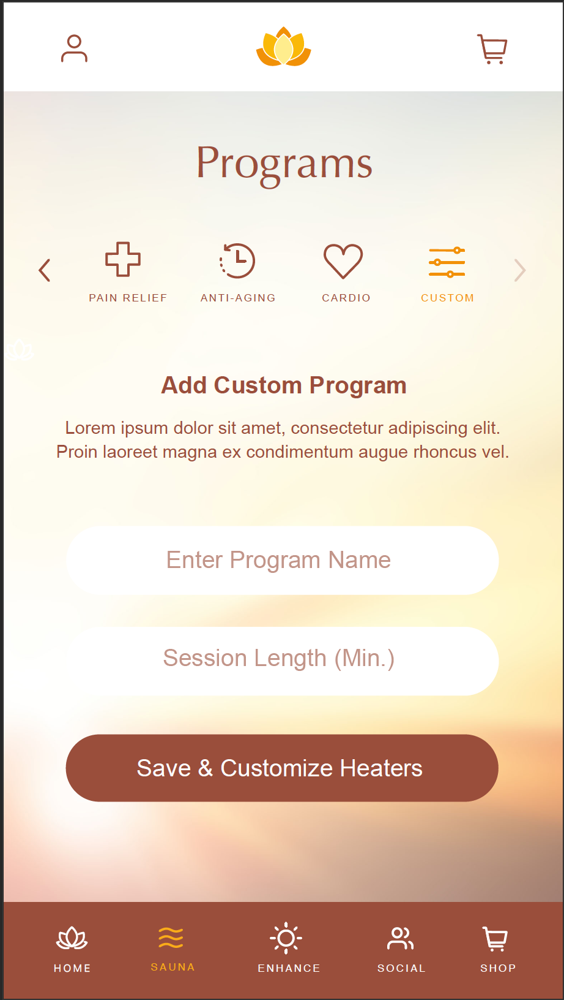

# Assignment - React Native developer

Develop a React Native app as per the following requirements.

## Context 

We are company which manufactures Saunas. We want our customers to have a natural experience to control their saunas using Android and iOS apps.

Our Saunas have multiple programs like Detox, Weight Loss, Relaxation etc. User can also define their own programs, we call then Custom Programs.

Each "Program" is a nothing but a per defined setting of temperature at which heaters are set in Sauna.

### Settings for programs

- Detox
  - Mid Heater temperature: 60' C
  - Far Heater temperature: 70' C
  - Session Time: 37 Mins
- Weight Loss
  - Mid Heater temperature: 70' C
  - Far Heater temperature: 75' C
  - Session Time: 45 Mins
- Relaxation
  - Near Heater temperature: 65' C
  - Mid Heater temperature: 60' C
  - Far Heater temperature: 65' C
  - Session Time: 40 Mins
- Pain Relief
  - Near Heater temperature: 60' C
  - Mid Heater temperature: 70' C
  - Far Heater temperature: 80' C
  - Session Time: 50 Mins
- Anti Aging
  - Mid Heater temperature: 65' C
  - Far Heater temperature: 70' C
  - Session Time: 35 Mins
- Cardio
  - Mid Heater temperature: 60' C
  - Far Heater temperature: 70' C
  - Session Time: 43 Mins

## Product Requirements 
- Screen 1: Show customer a screen on which he/she can select the program to start. Screen contains
  - A top white bar with a profile section access button on the top left
  - Sunlighten logo at the center
  - Shopping Cart button on the top right
  - A label displaying text "Programs"
  - A horizontal scrollable list of buttons
    - Each button click should display the contents of the program
  - A section shows contents of the program like
    - Description of program
    - Which heaters are going to be active in the program
    - Session length of the program
    - A start button to start the program
      - When you click on the Start button just display a message that program has been started.
    - Screen Mockups
  
  
  
  

- Screen 2:
  - When on Custom program list all the created custom programs crated by the user.
  - When clicked on the existing custom program open Screen 3
  - When clicked on "+" button open Screen 4
  - Screen Mockups
    

- Screen 3:
  - Display contents of custom programs similar to the contents of predefined screens
  - There are two additional buttons below Start Program button
  - Edit button: Show Screen 4
  - Delete Button: When clicked, show a message "Program Deleted"
    

- Screen 4:
  - Text Input box for Program Name
  - Text Input box for Session length of the Program
  - When clicked on "Save & Customize Headers" save the custom program and take the user back to Screen 2
  - Display the saved program in Customs program screen
  - Screen Mockups:
  

## Tech Requirements
 - Use https://github.com/infinitered/ignite for generating the boiler plate
 - Try to componentise everything to the extent possible
 - Try to make components stateless
 - Use MobX for state management
 - Follow the design in Mockups to the extent possible
 - Make sure the unit tests are present 
  
## Good to have
- Make sure the code is sensibly modularized
- Make sure the app runs on the iOS
- Make sure to follow best practices
- Make sure code is readable and maintainable

## How to do this assignment
- Create a branch with your emailid
- Add your code
- Notify us when you are done